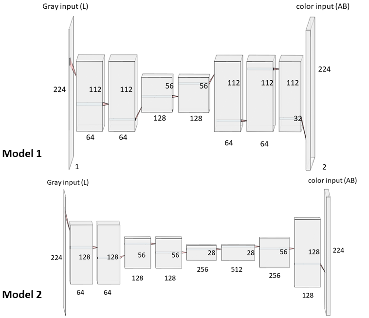
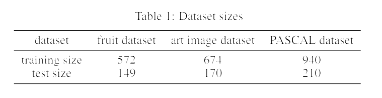
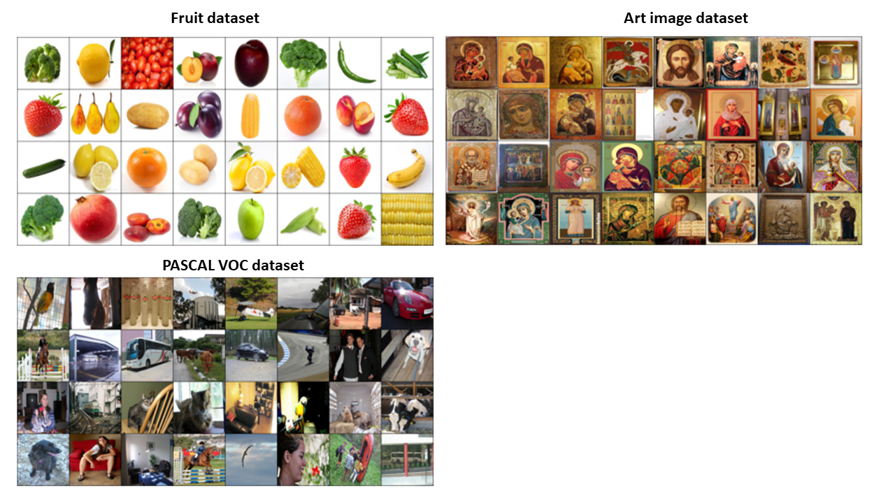
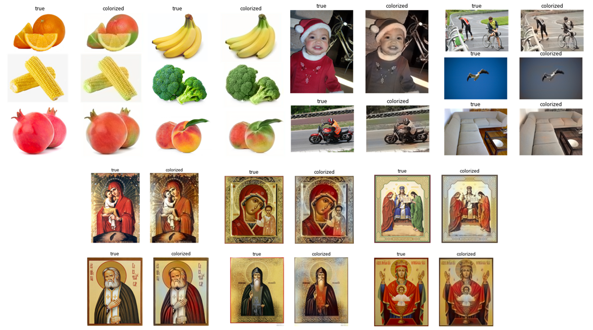
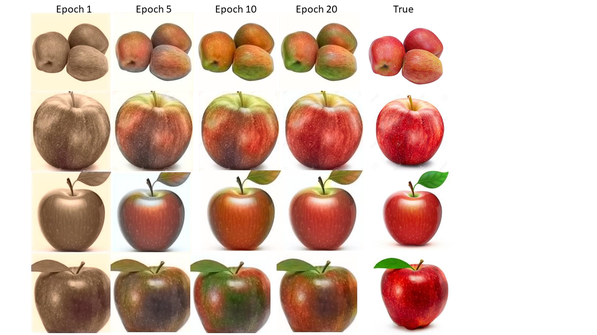

# Easy colorization using CNN structure

This code is to make easy colorization of grey images written by pytorch using CNN structure. The complete pipeline has been shown in the file `easy_colorization.ipynb`. Another file `utils.ipynb` is used to generate some additional results, such as the image grid for dataset and calculate color probability distribution of dataset.

Two different CNN structures are employed, **Model 1** is more complicated with more training parameters, while **Model 2** is easier and lighter with fewer training parameters. The structures are shown as below.

Three datasets are employed to train the two NNs, which are shown as below. The dataset can be downloaded using link [dataset](https://drive.google.com/file/d/1w9W4xfkx37_szxreUL-h2F8tcfatiPo2/view?usp=sharing). The dataset size is chosen as relatively small due to the limitation of computation resources. The dataset size is seen in the table below.

Some results can be seen here:

